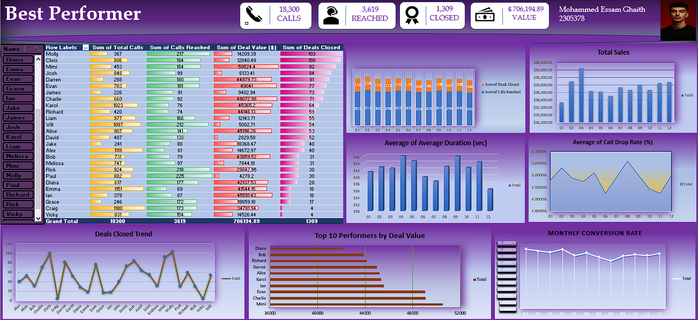

# Sales-Performance-Dashboard-Excel
Sales Performance Dashboard built entirely in Excel for data-driven insights and business decision support.

This project is a **Sales Performance Dashboard** built entirely using **Advanced Excel**.  
It provides **data-driven insights** to support real business decisions.

## Features
- Call Volume vs. Sales analysis
- Conversion Rate trends
- Top performers analysis
- Call Drop Rate & Average Call Duration analysis
- Actionable business insights from raw data
  
## Key Business Insights

- Quality of calls matters more than quantity  
- Mid-year dip in conversion indicates possible team fatigue  
- High-value deals drive more revenue than sheer volume  

## Tools Used
- Advanced Excel (Dashboards & Analysis)
- Data Modeling
- KPI Analysis

## Screenshots

## How to Use
1. Open `Best_Preformer_Dashboard_Mohammed-Essam-Ghaith.xlsx` in Excel.
2. Use the **Dashboard** tab to view KPIs and charts.
3. Update the data sheet to refresh the analysis.

## Feedback
If you’d like to discuss the dashboard or share feedback, feel free to contact me.

